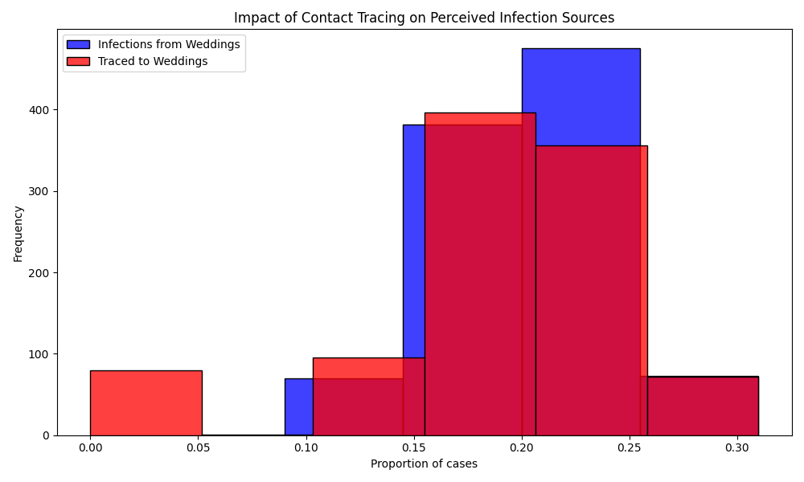

# ASSIGNMENT: Sampling and Reproducibility in Python

Read the blog post [Contact tracing can give a biased sample of COVID-19 cases](https://andrewwhitby.com/2020/11/24/contact-tracing-biased/) by Andrew Whitby to understand the context and motivation behind the simulation model we will be examining.

Examine the code in `whitby_covid_tracing.py`. Identify all stages at which sampling is occurring in the model. Describe in words the sampling procedure, referencing the functions used, sample size, sampling frame, any underlying distributions involved, and how these relate to the procedure outlined in the blog post.

Run the Python script file called whitby_covid_tracing.py as is and compare the results to the graphs in the original blog post. Does this code appear to reproduce the graphs from the original blog post?

Modify the number of repetitions in the simulation to 1000 (from the original 50000). Run the script multiple times and observe the outputted graphs. Comment on the reproducibility of the results.

Alter the code so that it is reproducible. Describe the changes you made to the code and how they affected the reproducibility of the script file. The output does not need to match Whitby’s original blogpost/graphs, it just needs to produce the same output when run multiple times

# Author: Mykhailo Vitvinov

```
Please write your explanation here...

The code in `whitby_covid_tracing.py` involves sampling at several stages:

**Event Assignment**:
- **Function**: `simulate_event`
- **Sample Size**: 1000 individuals
- **Sampling Frame**: `['wedding'] * 200 + ['brunch'] * 800`
- **Underlying Distribution**: Deterministic assignment (20% wedding, 80% brunch)
- **Description**: Each individual is assigned to either a wedding or a brunch event.

**Infection Sampling**:
- **Function**: `simulate_event`
- **Sample Size**: 10% of the total individuals (based on `ATTACK_RATE`)
- **Sampling Frame**: All individuals
- **Underlying Distribution**: Uniform random selection
- **Description**: A random 10% of individuals are marked as infected.

**Primary Tracing Sampling**:
- **Function**: `simulate_event`
- **Sample Size**: 20% of infected individuals (based on `TRACE_SUCCESS`)
- **Sampling Frame**: Infected individuals
- **Underlying Distribution**: Bernoulli trial for each infected individual with a success probability of 0.2
- **Description**: Each infected individual has a 20% chance of being traced.

**Secondary Tracing Sampling**:
- **Function**: `simulate_event`
- **Sample Size**: Varies based on the number of traced individuals per event
- **Sampling Frame**: Individuals at events with at least 2 traced individuals
- **Underlying Distribution**: Deterministic based on the event threshold
- **Description**: All infected individuals at events with at least two traced individuals are marked as traced.



## Criteria

|Criteria|Complete|Incomplete|
|--------|----|----|
|Altercation of the code|The code changes made, made it reproducible.|The code is still not reproducible.|
|Description of changes|The author explained the reasonings for the changes made well.|The author did not explain the reasonings for the changes made well.|

## Submission Information

🚨 **Please review our [Assignment Submission Guide](https://github.com/UofT-DSI/onboarding/blob/main/onboarding_documents/submissions.md)** 🚨 for detailed instructions on how to format, branch, and submit your work. Following these guidelines is crucial for your submissions to be evaluated correctly.

### Submission Parameters:
* Submission Due Date: `HH:MM AM/PM - DD/MM/YYYY`
* The branch name for your repo should be: `sampling-and-reproducibility`
* What to submit for this assignment:
    * This markdown file (sampling_and_reproducibility.md) should be populated.
    * The `whitby_covid_tracing.py` should be changed.
* What the pull request link should look like for this assignment: `https://github.com/<your_github_username>/sampling/pull/<pr_id>`
    * Open a private window in your browser. Copy and paste the link to your pull request into the address bar. Make sure you can see your pull request properly. This helps the technical facilitator and learning support staff review your submission easily.

Checklist:
- [ ] Create a branch called `sampling-and-reproducibility`.
- [ ] Ensure that the repository is public.
- [ ] Review [the PR description guidelines](https://github.com/UofT-DSI/onboarding/blob/main/onboarding_documents/submissions.md#guidelines-for-pull-request-descriptions) and adhere to them.
- [ ] Verify that the link is accessible in a private browser window.

If you encounter any difficulties or have questions, please don't hesitate to reach out to our team via our Slack at `#cohort-3-help`. Our Technical Facilitators and Learning Support staff are here to help you navigate any challenges.
